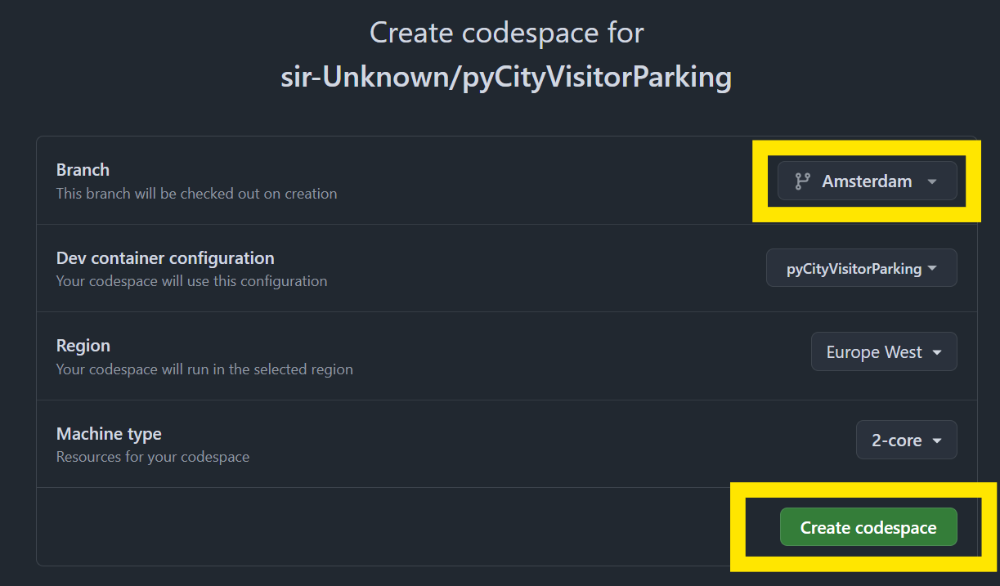
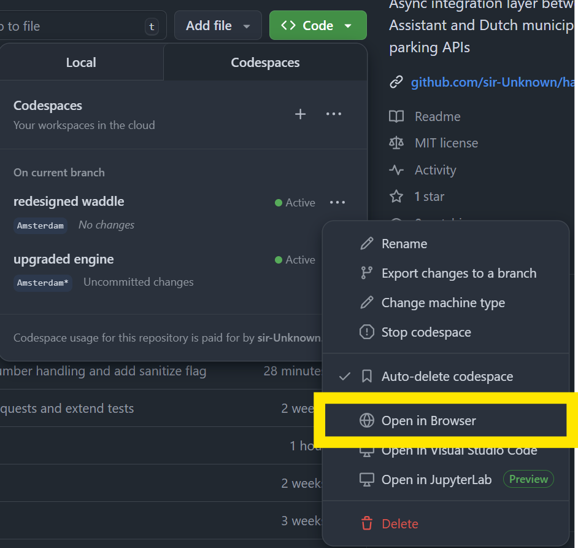
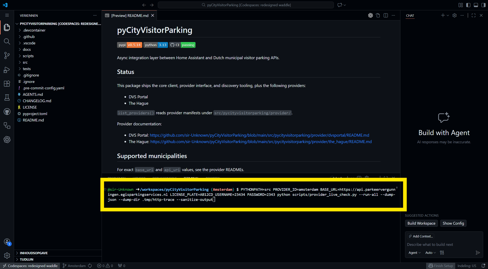
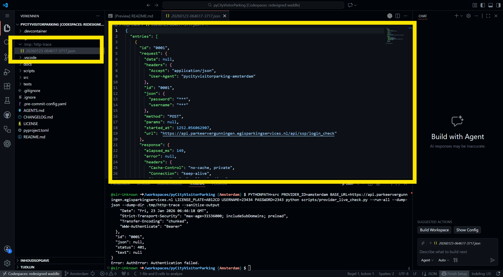

# Provider Development: Running Live Checks in GitHub Codespaces

This guide shows how to run `scripts/provider_live_check.py` from a GitHub
Codespace and share the sanitized output for debugging.

## Prerequisites

- Access to the repository on GitHub.
- Valid provider credentials (do not share them).

## 1) Create a Codespace

Start a new Codespace from the repository.

[](https://codespaces.new/sir-Unknown/pyCityVisitorParking/)

## 2) Select the branch

If you need to test a feature branch, select it after the Codespace is running.



## 3) Open the repository in the browser (optional)

If you need a quick link back to the repository, open it in the browser.



## 4) Run the live check script

Open the terminal inside the Codespace and run the script with your provider
inputs. This example uses the Amsterdam provider and writes a sanitized dump
file.

```bash
PYTHONPATH=src PROVIDER_ID=amsterdam \
BASE_URL=https://api.parkeervergunningen.egisparkingservices.nl \
USERNAME=... PASSWORD=... LICENSE_PLATE=AB12CD \
python scripts/provider_live_check.py \
  --run-all \
  --dump-json \
  --dump-dir .tmp/http-trace \
  --sanitize-output
```



## 5) Share the results safely

The script writes a single run file in `.tmp/http-trace/` with a name like
`YYYYMMDD-HHMMSS-PID.json`.

To share results:

1) Open the `.tmp/http-trace/` folder in the Codespace file explorer.
2) Open the newest run file and **confirm it contains no secrets** (the contents
   should be sanitized, but check yourself for tokens, passwords, names, and full
   license plates).
3) Copy the file contents or download the file and attach it to your issue.



## Tips

- Add `--debug-http` if you need request/response summaries in the terminal.
- Add `--traceback` to include full error tracebacks when debugging failures.
